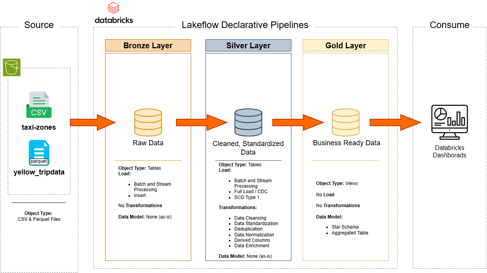
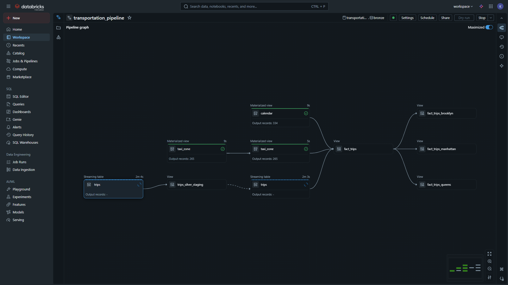
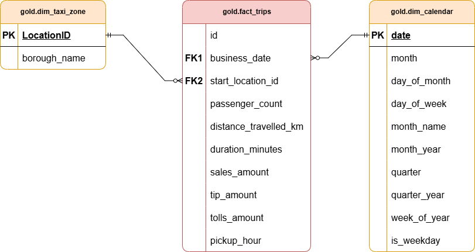
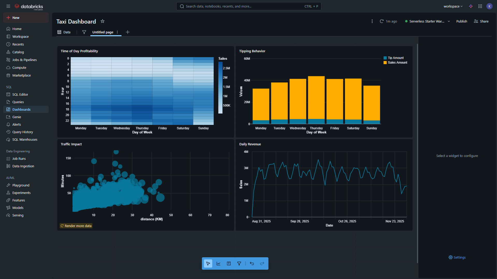

# NYC Taxi Data Pipeline on Databricks

Welcome to the **NYC Taxi Data Pipeline on Databricks** repository!

This project demonstrates a data engineering pipeline built using the Medallion Architecture. It leverages Databricks Lakeflow Spark Declarative Pipelines to ingest, transform, and model New York City taxi trip records and zone data into a high-performance Star Schema.
The pipeline concludes with a Databricks Dashboard, transforming raw trip data into visual insights for stakeholders.

## Data Architecture

The architecture follows the **Bronze**, **Silver**, and **Gold** layers to ensure data reliability and lineage across the Lakehouse:

**Bronze Layer**: Acts as the landing zone for raw data stored in Amazon S3. For taxi trips, implemented Databricks Auto Loader (cloudFiles) to provide a scalable streaming entry point.

- Auto ingestion: The pipeline is configured to automatically detect and process new monthly Parquet files as they arrive in the S3 source bucket.

**Silver Layer**: Focuses on data quality and enrichment. Transformations include converting distances, calculating trip durations, filtering outliers, and handling schema evolution. This layer also implements SCD Type 1 via Change Data Capture to maintain an up-to-date record of trips.

Gold Layer: Provides business-ready logic. It features a centralized fact_trips table joined with dimension tables (Calendar and Zones) and specialized views for borough-level analysis.

---

## Objective
Develop a robust Data Lakehouse on Databricks to process large-scale NYC Taxi data, providing stakeholders with validated, cleaned, and partitioned insights into trip patterns, durations, and revenue across NYC boroughs.

---

## Data Sources
The datasets used in this project are hosted on AWS S3, allowing the pipeline to scale with the addition of new trips data:
Dataset Availability: The raw datasets are accessible online at: [Datasets](https://www.nyc.gov/site/tlc/about/tlc-trip-record-data.page).

---

## Pipeline Workflow
To ensure the project is maintainable and scalable, it is built using Spark Declarative Pipelines. This approach separates the data transformation logic from the infrastructure management.

**Workflow Visualization**

Above is a screenshot of the automated DLT pipeline. It illustrates the lineage from the S3 source buckets through the Bronze and Silver tables, culminating in the Gold analytical views.

Declarative Logic: By using `@dp.table`, `@dp.materialized_view` and `@dp.view` decorators, the pipeline handles dependencies and schema evolution automatically.

---

## Data Modeling
The Gold Layer is structured as a Star Schema to optimize query performance for BI tools and downstream analytics:

Detailed descriptions of the schema are available in the Data Catalog, which can be found in the `/docs` folder of this repository.

---

## Data Lineage & Auditability
Lineage is automatically tracked within the Databricks Unity Catalog. Every table includes critical metadata for debugging and compliance:

`ingest_datetime`: The timestamp when the record first entered the Bronze layer.

`file_name`: The specific source file path (captured via `_metadata.file_path`).

`silver_processed_timestamp`: The exact time transformations and cleaning were applied.

---

## Gold Views
To streamline reporting and improve query performance, the pipeline implements a Star Schema that caters to both global and regional analytics. After analyzing trip distributions, Manhattan, Brooklyn, and Queens were identified as the top three boroughs with the highest trip density.

**Global Fact View**: The `fact_trips_gold` view serves as the primary source of truth, consolidating data from Silver trips, zones, and calendar tables across all NYC boroughs.

Borough-Specific Optimization: To simplify reporting for high-volume regional stakeholders, the pipeline includes specialized views for the top 3 boroughs:

`fact_trips_manhattan`: Filters the global fact table for Manhattan-specific insights.

`fact_trips_queens`: Optimized for Queens-based reporting.

`fact_trips_brooklyn`: Tailored for Brooklyn trip analysis.

These views abstract the join logic between trips and zones, allowing analysts to query their specific region immediately.

## Business Insights & Dashboards
The final Gold layer feeds into an interactive Databricks Dashboard, transforming the Star Schema into visual intelligence.

## License

This project is licenced under the [MIT License](LICENSE). You are free to use, modify, and share this project with proper attribution. 
